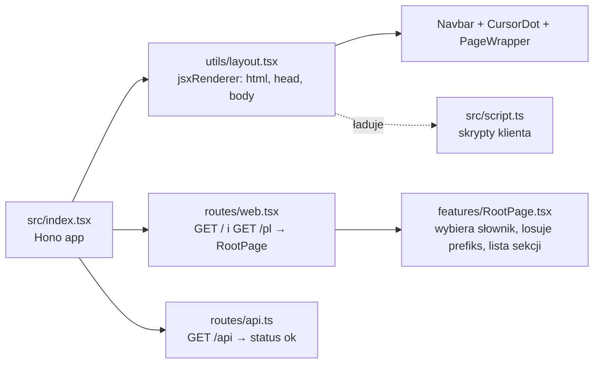

# whoami — portfolio Szymona Wardaka

Jednostronicowe portfolio (one-pager) renderowane po stronie serwera przez Hono i wdrażane na Cloudflare Workers. Dwie wersje językowe: angielska pod `/` i polska pod `/pl`.

## Stack

| Warstwa | Technologia |
|---|---|
| Serwer / routing / JSX | [Hono](https://hono.dev) (`hono/jsx`, `jsxRenderer`) |
| Build / dev server | Vite 8 + `@cloudflare/vite-plugin` + `vite-ssr-components` |
| Hosting | Cloudflare Workers (`wrangler`) |
| Style | Tailwind CSS v4 (`@tailwindcss/vite`) |
| Animacje (client) | `motion` |
| Font | JetBrains Mono Variable (`@fontsource-variable/jetbrains-mono`) |

## Uruchamianie

```sh
pnpm install
pnpm dev        # dev server Vite
pnpm build      # build produkcyjny
pnpm typecheck  # tsc -b: sprawdza typy kodu serwera i przeglądarki
pnpm preview    # build + podgląd
pnpm deploy     # build + wrangler deploy
pnpm cf-typegen # regeneruje worker-configuration.d.ts (typy runtime Workers); po każdej zmianie wrangler.jsonc
```

## Jak to działa



- **Serwer** renderuje cały HTML: `layout.tsx` owija każdą stronę w `<html lang>`, dokłada `<head>` (charset, viewport, `<title>`, `<meta name="description">`, linki `hreflang`, CSS i font), `Navbar`, `CursorDot`, `PageWrapper` (`<main>`) i `Footer`. Teksty bierze ze słownika języka strony (patrz „Języki strony”).
- **Klient** dostaje jeden skrypt, `src/script.ts`, który odpala interakcje: `cursor_dot()`, `navbar()`, `reveal()`, `hero()`, `life()` i `experience()`.

## Struktura

```
src/
├── index.tsx                  # Hono app: layout + trasy
├── script.ts                  # wejście skryptów klienta
├── style.css                  # Tailwind, font, @theme
├── i18n/
│   ├── index.ts               # LOCALES, Locale, dictionaries, localePath(), toLocale()
│   ├── en.ts                  # teksty EN; jego kształt to typ Dictionary
│   └── pl.ts                  # teksty PL (: Dictionary, więc nic nie może brakować)
├── routes/
│   ├── web.tsx                # GET / i GET /pl → <RootPage locale />
│   └── api.ts                 # GET /api (health check)
├── utils/
│   ├── layout.tsx             # jsxRenderer: szkielet dokumentu, <head> zależny od języka
│   └── code_language.ts       # pula języków programowania (prefiks komentarza) i randomCodeLanguage()
└── components/
    ├── base/                  # proste klocki UI (SectionLabel)
    ├── custom/                # elementy globalne strony
    │   ├── navbar/            # Navbar.tsx + navbar.client.ts (motyw jasny/ciemny)
    │   ├── coursor_dot/       # własny kursor (CursorDot.tsx, cursor_dot.client.ts, .css)
    │   ├── reveal/            # animacje wjazdu przy scrollu (reveal.client.ts, reveal.css)
    │   ├── life/              # Life.tsx + life.client.ts: tło „Gra w życie” (hero, stopka)
    │   └── footer/            # Footer.tsx: © rok (liczony przy renderze) + „built with…”, w tle <Life />
    ├── domain/                # sekcje strony
    │   ├── PageWrapper.tsx    # <main>
    │   ├── hero/              # Hero.tsx + hero.client.ts (parallax), w tle <Life />
    │   ├── about/
    │   ├── stack/
    │   ├── experience/        # Experience.tsx + experience.client.ts (karta przy kursorze)
    │   └── contact/
    └── features/
        └── RootPage.tsx       # składa sekcje w kolejności
```

Konwencja nazw: `Komponent.tsx` to markup renderowany na serwerze, `komponent.client.ts` w tym samym folderze to logika klienta, wywoływana w `script.ts`. Sufiks `.client` jest obowiązkowy: macOS nie rozróżnia wielkości liter, a Vite szuka `.ts` przed `.tsx`, więc `hero.ts` obok `Hero.tsx` przechwyciłby import komponentu (błąd 500).

## Sekcje strony

Kolejność z `RootPage.tsx`. Tła idą naprzemiennie: jasne, ciemne.

| # | Sekcja | `id` | Tło | `data-nav-theme` | Co zawiera |
|---|---|---|---|---|---|
| 1 | Hero | — | białe | `light` | Prezentacja, nie sekcja (bez etykiety i `h2`). Imię jako `h1` (`text-4xl sm:text-6xl lg:text-8xl`), nad nim `AKA OCG / AKA WARCHLIK` wyrównane do lewej krawędzi imienia, pod nim `FULL STACK SOFTWARE ENGINEER` do prawej. W tle Gra w życie w ASCII |
| 2 | About | `about` | `gray-800` | `dark` | Nagłówek, 3 zdania o mnie, fakty w pillach (`about.facts` w słowniku) |
| 3 | Stack | `stack` | białe | `light` | Okno „edytora” z drzewem plików: folder = język, plik = technologia (`folders` w komponencie, takie same w obu językach) |
| 4 | Experience | `experience` | `gray-800` | `dark` | Płaskie bloki od najnowszego; szczegóły w karcie przy kursorze (`experience.jobs` w słowniku) |
| 5 | Contact | `contact` | białe | `light` | Lista linków: email, LinkedIn, GitHub (`links` w komponencie) i CV w języku strony (`contact.cv` w słowniku: `public/szymon-wardak-cv-en.pdf` na `/`, `public/szymon-wardak-cv-pl.pdf` na `/pl`), otwierane w nowej karcie |
| — | Repo | `projects` | — | — | **Jeszcze nie ma** (brak nawet pustego komponentu). Pozycja `projects` w `sections` w `Navbar.tsx` jest zakomentowana |

## Zasady projektu

**Sekcje**
- Każda sekcja zajmuje co najmniej cały ekran: `min-h-dvh flex items-center`.
- Treść siedzi w kontenerze `w-full max-w-3xl mx-auto px-6 py-32 flex flex-col gap-8`.
- Nagłówek sekcji to mały label `<SectionLabel codeLanguage={codeLanguage} name={t.label} />` (`text-sm text-gray-400`), a pod nim `h2` (`text-3xl md:text-4xl font-bold leading-tight`).
- **Losowy prefiks:** `RootPage` przy każdym renderze woła raz `randomCodeLanguage()` i przekazuje wynik do sekcji (hero go nie dostaje). Etykiety dostają prefiks komentarza tego języka programowania (`# about`, `-- kontakt`, `REM stack`…). Nowy język = jedna linijka w `utils/code_language.ts`. To co innego niż język strony (`Locale`).
- Tła naprzemiennie `bg-white text-gray-800` i `bg-gray-800 text-white`. Każda sekcja **musi** mieć `data-nav-theme="light"` albo `"dark"`, bo inaczej navbar nie przełączy kolorów.

**Styl**
- Płasko: bez cieni, bez zaokrągleń. Wyjątek to pille w About (`rounded-full`).
- Ramki `border-gray-800` na jasnym tle, `border-white/10` na ciemnym.
- Znak rozpoznawczy to kwadracik `size-1.5 bg-current`: navbar, drzewo w Stacku, lista w Contact.
- Cała strona w JetBrains Mono (`font-mono` na `<body>`).

**Dane**
- Teksty do tłumaczenia (nagłówki, akapity, `facts`, `jobs`, plik CV, etykiety navbara, stopka, `<title>`, opis) są w słownikach `src/i18n/en.ts` i `pl.ts`. Dane wspólne dla obu języków (`folders` w Stack, `links` w Contact bez CV) zostają w tablicach na górze pliku komponentu z `as const satisfies Typ[]`. Zmiana treści nie wymaga grzebania w JSX.

**Języki strony (i18n)**
- Język wynika **tylko z adresu**: `/` = `en`, `/pl` = `pl`. Wykrywa go wbudowany `languageDetector` z `hono/language` (`order: ['path']`, `caches: false`), więc bez ciasteczek i nagłówka `Accept-Language`: ten sam link zawsze pokazuje ten sam język. `/en` i inne ścieżki dają 404.
- `routes/web.tsx` rejestruje trasę dla każdego `LOCALES` (`localePath()`), a `toLocale(c.get('language'))` zamienia wynik detektora na `Locale`. `RootPage` dostaje `locale` i przekazuje sekcjom ich część słownika (`t.about`, `t.stack`…); `layout.tsx` czyta język przez `useRequestContext()`.
- `<html lang>`, `<title>` i opis zależą od języka, a w `<head>` są linki `hreflang` (`en`, `pl`, `x-default` → `/`) z pełnym adresem zbudowanym z bieżącego żądania.
- Nowy tekst: dopisz klucz w `en.ts`, TypeScript wymusi go w `pl.ts`. Nowy język: dodaj go do `LOCALES`, utwórz słownik `: Dictionary` i wpisz w `dictionaries`; trasa, `hreflang` i przełącznik w navbarze dojdą same.

**TypeScript**
- Kod serwera i przeglądarki ma sprzeczne typy globalne (`Request`, `URL`… z Workers vs z DOM), więc to dwa projekty: `tsconfig.worker.json` (wszystko w `src/` poza klientem; `lib: ESNext` + `worker-configuration.d.ts`) i `tsconfig.client.json` (`src/script.ts` + `**/*.client.ts`; `lib: ESNext, DOM`). Wspólne opcje są w `tsconfig.base.json`, a `tsconfig.json` tylko wskazuje oba projekty, żeby edytor i `tsc -b` wybrały właściwy dla każdego pliku.
- Skutek: w kodzie serwera nie da się użyć `document`/`window`, a w `*.client.ts` typów Workers. Nowy skrypt przeglądarki musi mieć sufiks `.client.ts`, inaczej trafi do projektu serwera.
- `worker-configuration.d.ts` generuje `pnpm cf-typegen` (`wrangler types`); plik jest w repo i trzeba go odświeżyć po zmianie `wrangler.jsonc` (np. `compatibility_date`, bindingi).

**Interakcje**
- Element klikalny dostaje `data-hover`, wtedy kropka kursora rośnie nad nim.
- Animacja wjazdu przy scrollu: `data-reveal` (wjazd od dołu), `data-reveal="fade"` (samo pojawienie się, bez `transform`, np. gdy w środku jest element `fixed`), `data-reveal-group` + `data-reveal-item` (lista po kolei). Nie dawaj tego na `<section>`, bo przesunięcie psuje wykrywanie motywu navbara.
- Hover w Tailwind v4 działa tylko na urządzeniach z myszką. Zachowanie tylko dla myszki: `pointer-fine:`.

## Kluczowe komponenty

### Navbar (`custom/navbar/`)
- `fixed` u góry i wyśrodkowany, nie zajmuje miejsca w układzie strony, więc nie dokłada scrolla.
- **Zwinięty:** płaska kreska (`p-1`) z kwadracikami. **Rozwinięty** (hover albo focus z klawiatury): kwadraciki znikają (`size-0 opacity-0`), pojawiają się etykiety.
- Etykiety rosną dzięki trikowi z gridem: `grid-cols-[0fr] grid-rows-[0fr]` → `[1fr]`, a na wewnętrznym spanie `min-w-0 min-h-0 overflow-hidden`. CSS nie umie animować do `width: auto`, za to wartości `fr` animować umie.
- Niewidzialny wrapper z paddingiem (`px-10 pt-5 pb-8`) sprawia, że menu otwiera się już przy zbliżeniu myszki.
- **Pozycje:** sekcje (`sections`, etykiety z `t.nav`) idą w kolejności sekcji na stronie, a na końcu przełącznik języka (link do każdego innego `LOCALES`, np. `PL` na `/`, `EN` na `/pl`). Symbol przed etykietą to kolejny znak z `!@#$%^&*` (Shift+1…8) według pozycji, więc ciąg nigdy się nie urywa: dziś `!Main @About #Stack $Exp %Con ^PL`. Sekcja Repo: odkomentować `projects` w `sections` i dodać klucz `projects` do `nav` w słownikach; symbole przesuną się same.
- **Motyw:** `navbar.client.ts` przy scrollu i resize (najwyżej raz na klatkę, przez `requestAnimationFrame`) sprawdza, która sekcja jest pod środkiem navbara, i ustawia `data-theme` na `<nav>`. Klasy `data-[theme=dark]:bg-white data-[theme=dark]:text-gray-800` odwracają kolory, a kwadraciki (`bg-current`) odwracają się same.

### Kursor (`custom/coursor_dot/`)
- Własna kropka `position: fixed`, `mix-blend-mode: difference`, sterowana przez `motion` (sprężyna). Rośnie nad elementami z `data-hover`. Na urządzeniach dotykowych jest wyłączona.

### Hero (`domain/hero/`)
- `hero.client.ts`: parallax, czyli przy scrollu pierwszego ekranu napis odjeżdża o 120px i znika. Używa `scroll(callback)`, bo `scroll(animate(...))` w `motion` 13.4 ignoruje `offset` dla `y`.
- Przy `prefers-reduced-motion: reduce` parallax jest wyłączony.
- W tle `<Life class="text-gray-400" />`, patrz niżej.

### Gra w życie (`custom/life/`)
- `<Life class="text-…" />` wstawia `<pre data-life>` na cały rodzic (`absolute inset-0`, `pointer-events-none`, `aria-hidden`). Rodzic musi mieć `relative overflow-hidden`, a treść nad tłem `relative`. Klasa ustala kolor komórek: hero `text-gray-400`, stopka `text-gray-200`.
- `life.client.ts` (`life()` w `script.ts`) uruchamia osobną symulację dla każdego `[data-life]` na stronie, dopasowaną do rozmiaru rodzica. Gra w życie w podwójnej rozdzielczości, port „Golgol” (`gol_double_res`) z [play.core](https://github.com/ertdfgcvb/play.core) (Apache-2.0): każdy znak to dwie komórki jedna nad drugą (`█ ▀ ▄` i spacja).
- Start z losowego stanu, krok co `1000 / FPS` ms (`FPS = 24`). Przytrzymanie i przeciągnięcie myszką/palcem nad rodzicem sieje losowy kwadrat 11×11.
- Siatka przelicza się przy zmianie rozmiaru i po załadowaniu fontu. Każda warstwa staje, gdy jej rodzic jest poza ekranem; przy `prefers-reduced-motion: reduce` zostaje jedna nieruchoma klatka.

### Stack (`domain/stack/`)
- Foldery to natywne `<details open>` / `<summary>`: zwijanie bez JS-a, działa z klawiatury. Kwadracik przy folderze obraca się przez `group-open/folder:rotate-90`.
- Na szerokich ekranach 2 kolumny, na telefonie 1.

### Experience (`domain/experience/`)
- Blok pokazuje rolę, firmę, okres i jedno zdanie (`summary`).
- Karta ze szczegółami (`description` + technologie jako klocuszki) jest w HTML-u od początku, co jest dobre dla SEO i czytników ekranu.
  - **Z myszką** (`pointer-fine:`): karta ma `fixed`, jest ukryta, a `experience.client.ts` przy hoverze pokazuje ją i przesuwa za kursorem sprężyną `motion`. Przy prawej krawędzi ekranu przeskakuje na lewą stronę kursora, przy dolnej podnosi się.
  - **Na dotyku:** karta wyświetla się normalnie w bloku, a skrypt się nie odpala.

## Jak dodać nową sekcję

1. Utwórz `src/components/domain/<nazwa>/<Nazwa>.tsx`.
2. `<section id="<nazwa>" data-nav-theme="light|dark" class="w-full min-h-dvh flex items-center bg-… text-…">`, tło przeciwne do poprzedniej sekcji.
3. W środku kontener `max-w-3xl`, `<SectionLabel codeLanguage={codeLanguage} name={t.label} />` i `h2`, jak w innych sekcjach. Komponent przyjmuje `{ codeLanguage, t }: { codeLanguage: CodeLanguage; t: Dictionary['<nazwa>'] }`.
4. Teksty w słownikach: nowy klucz `<nazwa>` w `src/i18n/en.ts` (np. `label`, `heading`) i odpowiednik w `pl.ts`. Dane wspólne dla obu języków w tablicy na górze pliku komponentu.
5. Dodaj komponent w `RootPage.tsx` (`t={t.<nazwa>}`) i ewentualnie pozycję w `sections` w `Navbar.tsx` plus jej etykietę w `nav` w słownikach.
6. Jeśli sekcja potrzebuje JS-a: `<nazwa>.client.ts` z eksportowaną funkcją, wywołaną w `src/script.ts`.

## Otwarte sprawy

- [ ] **Sekcja Repo** (`#projects`): czeka na skończone projekty. Po Contact (jasnym) wypada ciemna, a jeśli wejdzie przed Contact, trzeba przestawić tła. Pozycja w navbarze jest do tego czasu zakomentowana (patrz „Navbar”).
- [ ] **Podgląd linku (Open Graph):** brak `og:title`, `og:description`, `og:image`, więc po wklejeniu linku na LinkedIn / Slack / Messenger nie pojawia się ładna karta z tytułem i obrazkiem. Tytuł i opis są już w słownikach, więc `og:*` wystarczy wziąć z `t.meta`.
