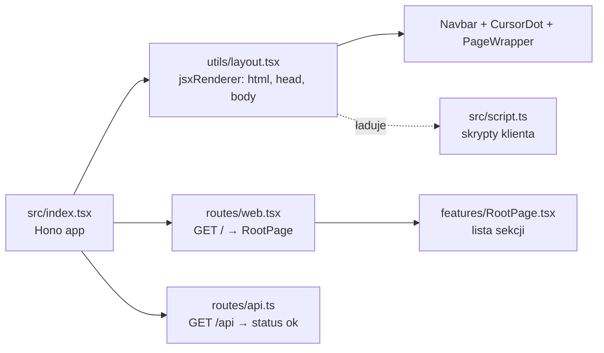

# whoami — portfolio Szymona Wardaka

Jednostronicowe portfolio (one-pager) renderowane po stronie serwera przez Hono i wdrażane na Cloudflare Workers. Treść strony jest po angielsku.

## Stack

| Warstwa | Technologia |
|---|---|
| Serwer / routing / JSX | [Hono](https://hono.dev) (`hono/jsx`, `jsxRenderer`) |
| Build / dev server | Vite 8 + `@cloudflare/vite-plugin` + `vite-ssr-components` |
| Hosting | Cloudflare Workers (`wrangler`) |
| Style | Tailwind CSS v4 (`@tailwindcss/vite`), `tw-animate-css` |
| Animacje (client) | `motion` |
| Font | JetBrains Mono Variable (`@fontsource-variable/jetbrains-mono`) |
| Walidacja (API) | `zod`, `@hono/zod-validator` |

## Uruchamianie

```sh
pnpm install
pnpm dev        # dev server Vite
pnpm build      # build produkcyjny
pnpm preview    # build + podgląd
pnpm deploy     # build + wrangler deploy
pnpm cf-typegen # typy bindingów Cloudflare
```

## Jak to działa



- **Serwer** renderuje cały HTML: `layout.tsx` owija każdą stronę w `<html>`, dokłada CSS i font, `Navbar`, `CursorDot` i `PageWrapper` (`<main>`).
- **Klient** dostaje jeden skrypt, `src/script.ts`, który odpala interakcje: `cursor_dot()`, `navbar()`, `hero()` i `experience()`.

## Struktura

```
src/
├── index.tsx                  # Hono app: layout + trasy
├── script.ts                  # wejście skryptów klienta
├── style.css                  # Tailwind, font, @theme
├── routes/
│   ├── web.tsx                # GET / → <RootPage />
│   └── api.ts                 # GET /api (health check)
├── utils/
│   └── layout.tsx             # jsxRenderer: szkielet dokumentu
└── components/
    ├── base/                  # proste klocki UI (Button)
    ├── custom/                # elementy globalne strony
    │   ├── navbar/            # Navbar.tsx + navbar.ts (motyw jasny/ciemny)
    │   ├── coursor_dot/       # własny kursor (CursorDot.tsx, cursor_dot.ts, .css)
    │   └── HugeText.tsx       # nieużywany (imię jest wpisane w Hero)
    ├── domain/                # sekcje strony
    │   ├── PageWrapper.tsx    # <main>
    │   ├── hero/
    │   ├── about/
    │   ├── stack/
    │   ├── experience/        # Experience.tsx + experience.ts (karta przy kursorze)
    │   ├── contact/
    │   └── projects/          # puste — czeka na projekty
    └── features/
        └── RootPage.tsx       # składa sekcje w kolejności
```

Konwencja nazw: `Komponent.tsx` to markup renderowany na serwerze, `komponent.ts` w tym samym folderze to logika klienta, wywoływana w `script.ts`.

## Sekcje strony

Kolejność z `RootPage.tsx`. Tła idą naprzemiennie: jasne, ciemne.

| # | Sekcja | `id` | Tło | `data-nav-theme` | Co zawiera |
|---|---|---|---|---|---|
| 1 | Hero | — | białe | `light` | Imię (`text-8xl`), nad nim `AKA OCG / AKA WARCHLIK` wyrównane do lewej krawędzi imienia, pod nim `FULL STACK ENGINEER` do prawej |
| 2 | About | `about` | `gray-800` | `dark` | Nagłówek, 3 zdania o mnie, fakty w pillach (`facts`) |
| 3 | Stack | `stack` | białe | `light` | Okno „edytora” z drzewem plików: folder = język, plik = technologia (`folders`) |
| 4 | Experience | `experience` | `gray-800` | `dark` | Płaskie bloki od najnowszego; szczegóły w karcie przy kursorze (`jobs`) |
| 5 | Contact | `contact` | białe | `light` | Lista linków: email, GitHub (`links`) |
| — | Repo | `projects` | — | — | **Jeszcze nie ma**. Link w navbarze już istnieje |

## Zasady projektu

**Sekcje**
- Każda sekcja zajmuje co najmniej cały ekran: `min-h-dvh flex items-center`.
- Treść siedzi w kontenerze `w-full max-w-3xl mx-auto px-6 py-32 flex flex-col gap-8`.
- Nagłówek sekcji to mały label `// nazwa` (`text-sm text-gray-400`), a pod nim `h2` (`text-3xl md:text-4xl font-bold leading-tight`).
- Tła naprzemiennie `bg-white text-gray-800` i `bg-gray-800 text-white`. Każda sekcja **musi** mieć `data-nav-theme="light"` albo `"dark"`, bo inaczej navbar nie przełączy kolorów.

**Styl**
- Płasko: bez cieni, bez zaokrągleń. Wyjątek to pille w About (`rounded-full`).
- Ramki `border-gray-800` na jasnym tle, `border-white/10` na ciemnym.
- Znak rozpoznawczy to kwadracik `size-1.5 bg-current`: navbar, drzewo w Stacku, lista w Contact.
- Cała strona w JetBrains Mono (`font-mono` na `<body>`).

**Dane**
- Treść trzymamy w tablicach na górze pliku komponentu (`items`, `facts`, `folders`, `jobs`, `links`) z `as const satisfies Typ[]`. Zmiana treści nie wymaga grzebania w JSX.

**Interakcje**
- Element klikalny dostaje `data-hover`, wtedy kropka kursora rośnie nad nim.
- Hover w Tailwind v4 działa tylko na urządzeniach z myszką. Zachowanie tylko dla myszki: `pointer-fine:`.

## Kluczowe komponenty

### Navbar (`custom/navbar/`)
- `fixed` u góry i wyśrodkowany, nie zajmuje miejsca w układzie strony, więc nie dokłada scrolla.
- **Zwinięty:** płaska kreska (`p-1`) z kwadracikami. **Rozwinięty** (hover albo focus z klawiatury): kwadraciki znikają (`size-0 opacity-0`), pojawiają się etykiety.
- Etykiety rosną dzięki trikowi z gridem: `grid-cols-[0fr] grid-rows-[0fr]` → `[1fr]`, a na wewnętrznym spanie `min-w-0 min-h-0 overflow-hidden`. CSS nie umie animować do `width: auto`, za to wartości `fr` animować umie.
- Niewidzialny wrapper z paddingiem (`px-10 pt-5 pb-8`) sprawia, że menu otwiera się już przy zbliżeniu myszki.
- **Motyw:** `navbar.ts` przy scrollu i resize (najwyżej raz na klatkę, przez `requestAnimationFrame`) sprawdza, która sekcja jest pod środkiem navbara, i ustawia `data-theme` na `<nav>`. Klasy `data-[theme=dark]:bg-white data-[theme=dark]:text-gray-800` odwracają kolory, a kwadraciki (`bg-current`) odwracają się same.

### Kursor (`custom/coursor_dot/`)
- Własna kropka `position: fixed`, `mix-blend-mode: difference`, sterowana przez `motion` (sprężyna). Rośnie nad elementami z `data-hover`. Na urządzeniach dotykowych jest wyłączona.

### Stack (`domain/stack/`)
- Foldery to natywne `<details open>` / `<summary>`: zwijanie bez JS-a, działa z klawiatury. Strzałka obraca się przez `group-open/folder:rotate-90`.
- Na szerokich ekranach 2 kolumny, na telefonie 1.

### Experience (`domain/experience/`)
- Blok pokazuje rolę, firmę, okres i jedno zdanie (`summary`).
- Karta ze szczegółami (`description` + technologie jako klocuszki) jest w HTML-u od początku, co jest dobre dla SEO i czytników ekranu.
  - **Z myszką** (`pointer-fine:`): karta ma `fixed`, jest ukryta, a `experience.ts` przy hoverze pokazuje ją i przesuwa za kursorem sprężyną `motion`. Przy prawej krawędzi ekranu przeskakuje na lewą stronę kursora, przy dolnej podnosi się.
  - **Na dotyku:** karta wyświetla się normalnie w bloku, a skrypt się nie odpala.

## Jak dodać nową sekcję

1. Utwórz `src/components/domain/<nazwa>/<Nazwa>.tsx`.
2. `<section id="<nazwa>" data-nav-theme="light|dark" class="w-full min-h-dvh flex items-center bg-… text-…">`, tło przeciwne do poprzedniej sekcji.
3. W środku kontener `max-w-3xl`, label `// <nazwa>` i `h2`, jak w innych sekcjach.
4. Treść w tablicy na górze pliku.
5. Dodaj komponent w `RootPage.tsx` i ewentualnie pozycję w `items` w `Navbar.tsx`.
6. Jeśli sekcja potrzebuje JS-a: `<nazwa>.ts` z eksportowaną funkcją, wywołaną w `src/script.ts`.

## Otwarte sprawy

- [ ] **Sekcja Repo** (`#projects`): czeka na skończone projekty. Po Contact (jasnym) wypada ciemna, a jeśli wejdzie przed Contact, trzeba przestawić tła.
- [ ] **`<meta name="viewport" content="width=device-width, initial-scale=1">`** w `<head>` w `layout.tsx`. Bez tego telefon renderuje stronę jako desktop ok. 980px, pomniejszoną.
- [ ] **Kolejność w navbarze:** `@Exp` stoi przed `#About`, a na stronie Experience jest po Stacku.
- [ ] **`tsconfig.json`**: `"lib": ["ESNext"]` bez `"DOM"`, więc LSP zgłasza błędy `window` / `document` w plikach `.ts` klienta. Vite buduje mimo to.
- [ ] **`HugeText.tsx`** jest nieużywany: usunąć albo wrócić do niego w Hero.
- [ ] `projects.ts` i `Projects.tsx` są puste. `hero.ts` eksportuje pustą funkcję `hero()`, która i tak jest wywoływana w `script.ts`.
- [ ] Stopka: w `layout.tsx` jest tylko komentarz `{/* Footer component */}`.
